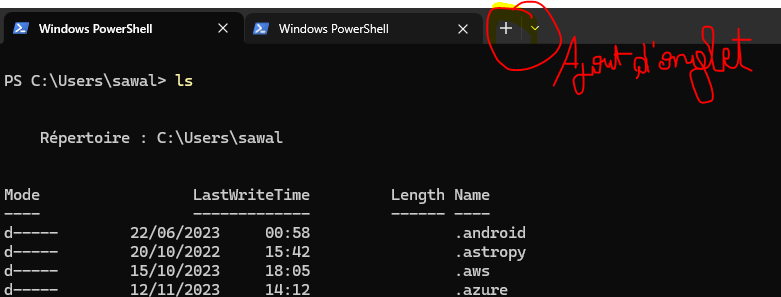

---

date: 2024-05-18  
authors:  
   - ssawadogo  
categories:  
   - Tips  
---

# Utilisation d'alias - gestions des variables d'environnement -Windows terminal
Dans cet article, je vais partager avec vous quelques astuces qui peuvent grandement améliorer votre efficacité en développement : l'utilisation d'alias, la gestion des variables d'environnement, et l'usage du nouveau terminal de Windows. En tant que développeur ou data scientist, vous savez que de nombreuses tâches répétitives peuvent devenir sources de frustration. Par exemple, répéter sans cesse `export LLM_KEY="macle"` pour que votre code récupère la clé via `os.getenv()` peut vite devenir fastidieux.

Voyons comment créer un fichier d'environnement pour centraliser les variables nécessaires et un alias pour accéder rapidement à ce répertoire et exécuter votre script.
<!-- more -->


#### 1. Préparer votre terminal

Avant de commencer, assurez-vous d'avoir **Windows Terminal** installé sur votre machine si vous travaillez sous Windows. Ce terminal moderne permet d'accéder à des shells comme PowerShell, l'Invite de Commande, et des environnements Linux via le **Windows Subsystem for Linux (WSL)**. Il offre une expérience utilisateur proche de celle d'un shell Bash sous Linux, avec une gestion intuitive des onglets pour éviter la multiplication des fenêtres.

> **Conseil :** Windows Terminal est bien plus agréable que CMD ou même l'invite de commande WSL standard. Sa gestion des onglets permet de travailler sur plusieurs fenêtres en parallèle dans une seule interface. Plus besoin de jongler entre plusieurs fenêtres !
voici à quoi il ressemble :

Bon, j'arrète de faire du marketing gratuitement pour microsoft. :)

[Télécharger Windows Terminal](https://apps.microsoft.com/detail/9n0dx20hk701?hl=en-US&gl=US)

#### 2. Créer un fichier `env.sh`

Pour centraliser vos variables d'environnement, créez un fichier `env.sh` qui pourra être appelé à chaque lancement de projet. Si vous avez un éditeur en ligne de commande comme `nano` ou `vim` :

```bash
nano env.sh
```

Sinon, créez simplement le fichier depuis un éditeur de texte comme Notepad ou Visual Studio Code, et ajoutez-y le contenu suivant :

```bash
#!/bin/bash
export MY_VARIABLE="Valeur"
export API_KEY="VotreCléAPI"
```

Enregistrez le fichier sous le nom `env.sh` et **rendez-le exécutable** (si vous êtes dans un terminal compatible avec Bash) :

```bash
chmod +x env.sh
```

#### 3. Configurer un alias dans Bash

Créez un alias qui vous permettra de changer de répertoire et de charger vos variables d'environnement en une seule commande.

1. **Éditez votre fichier de configuration Bash** (ou créez-en un si nécessaire) :

   ```bash
   nano ~/.bashrc
   ```

2. **Ajoutez l'alias** en bas du fichier, pour faciliter l'accès au dossier et le chargement des variables d'environnement. Ici, je crée un alias local vers mon projet car je trouve fastidieux de taper `cd` à chaque fois pour me rendre dans le dossier :

   ```bash
   alias workspace='cd ~/Desktop/"Project X" && source env.sh'
   ```

Si vous n'avez pas `nano` ou `vim`, modifiez simplement le fichier `.bashrc` dans un éditeur de texte comme Notepad ou Visual Studio Code. Le fichier `.bashrc` se trouve généralement dans votre répertoire personnel, aux emplacements suivants :
- Sous Linux et macOS : `~/.bashrc`
- Sous Windows avec WSL : `/home/nom_utilisateur/.bashrc`

#### 4. Appliquer les modifications

Pour que les modifications soient prises en compte, rechargez le fichier de configuration :

```bash
source ~/.bashrc
```

Ou, tout simplement, fermez et relancez un nouveau terminal.

#### 5. Utilisation pratique

Désormais, à chaque fois que vous souhaitez lancer votre projet, il vous suffit de taper :

```bash
workspace
```

Cette commande vous amènera dans le répertoire `Project X` et exécutera le fichier `env.sh`, chargeant ainsi vos variables d'environnement.

Ensuite, pour lancer un script Python, tapez simplement :

```bash
python votre_script.py
```

Vérifiez que `votre_script.py` se trouve bien dans le répertoire `Project X` pour qu'il puisse s'exécuter correctement.

### Conclusion

L'utilisation d'alias Bash est une pratique simple mais puissante pour simplifier votre flux de travail et réduire le risque d'erreurs. En quelques commandes, vous pouvez structurer efficacement vos projets et vous concentrer sur l'essentiel. Par exemple, si une commande comme `kubectl logs nom_du_pod` vous pèse, vous pouvez utiliser un alias `k logs nom_du_pod` pour simplifier vos appels. Ce petit changement peut sembler anodin, mais combiné à d'autres tâches, il améliore considérablement l'efficacité et rend les sessions terminal plus fluides.