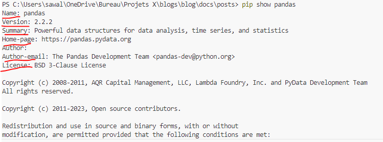
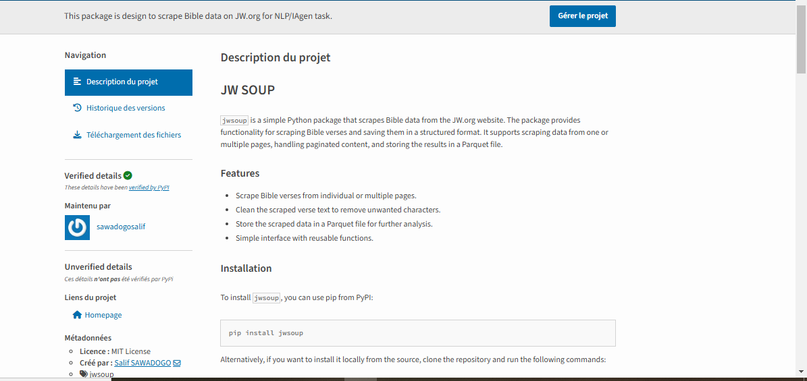
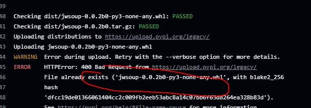
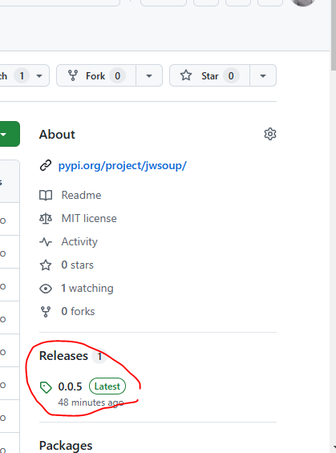

# Construire et publier son propre package Open Source Python   

Quand on débute avec Python pour l’analyse de données, on commence souvent par installer des packages comme **NumPy** ou **Pandas** après avoir configuré Python. Au fil du temps, lorsqu’on gère plusieurs projets, on se retrouve avec une "boîte à outils" composée de fonctions récurrentes que l’on transporte de projet en projet.  

Mais, au lieu de copier et coller du code, pourquoi ne pas structurer ce travail dans un **package Python** ? Cela facilite le partage et l’utilisation, que ce soit par vos collègues ou la communauté.  


Je me souviens qu’à l’époque où j’étais en école d’ingénieur, chaque fois que j’installais un package avec `pip install`, je me demandais comment il était possible de créer ces outils accessibles à tous. Voir les informations d’un package avec une commande comme `pip show` me fascinait (image en bas).
  
 C’est cette curiosité qui m’a poussé à explorer le fonctionnement interne des packages Python et à apprendre comment les concevoir moi-même.  

<!-- more -->

Dans cet article, nous allons découvrir les étapes et les bonnes pratiques pour construire et publier votre propre package Python, de votre ordinateur local jusqu’à **PyPI (Python Package Index)**.

## I. Pourquoi créer un package ?

Si vous êtes passionné de **data science**, vous avez probablement l’habitude de créer des fonctions que vous stockez dans des notebooks ou des fichiers `.py`. Cependant, au fur et à mesure que votre code devient complexe, il devient plus logique et efficace de regrouper ces fonctions dans un **package**.  

Imaginez que vous avez développé un algorithme performant. Plutôt que de l’envoyer à vos collègues sous forme de fichiers, vous pourriez publier un package que tout le monde peut installer facilement avec `pip`. Et dans l’esprit de l’open source, vous pourriez même partager ce travail avec la communauté mondiale.  


## II. Les étapes de l'open source packaging

Un **package Python** est une collection de code réutilisable, comme **NumPy** ou **Pandas**, qui aide les développeurs à résoudre des problèmes spécifiques. Publier un package open source signifie que ce code est accessible gratuitement à tous, sous réserve d’une licence (par exemple, MIT ou GPL).  

Cela peut sembler compliqué au départ, mais les étapes sont simples si elles sont bien suivies. Voici une vue d’ensemble pour créer et partager un package open source : Les étapes pour construire un package Python**  

### a. Créez une structure claire  
Voici un exemple de structure typique pour un package :  

```
my_package/
├── my_package/
│   ├── __init__.py      # Fichier qui rend le dossier utilisable comme un package
│   ├── module1.py       # Contient une fonction ou classe
│   └── module2.py
├── tests/               # Tests unitaires
│   ├── test_module1.py
├── setup.py             # Fichier de configuration pour installer le package
├── README.md            # Description de votre package
├── LICENSE              # Type de licence choisie
└── requirements.txt     # Dépendances nécessaires
```  

### b. Du code réutilisable  
Placez vos fonctions et classes dans des fichiers `.py` bien organisés. Documentez-les avec des docstrings et ajoutez des exemples d’utilisation.  

### c. Des tests unitaires  
Les tests permettent de garantir la fiabilité de votre package. Par exemple, avec **pytest** :  
Comme dirait un de mes collègue, si ton projet a des tests bien écrit, on a meme pas besoin de la documentation pour comprendre le projet.

### d. Un fichier `setup.py`  
Ce fichier décrit votre package et ses dépendances. Exemple :  
```python
from setuptools import setup, find_packages

setup(
    name="my_package",
    version="0.1",
    description="Un package simple pour la data science",
    author="Votre Nom",
    license="MIT",
    packages=find_packages(),
    install_requires=["numpy", "pandas"],
)
```  
Si vous rappeler de l'image en introductiona avec le pip , show c est ce fameux fichier qui est a l'origine.

### e. Choisissez une licence 
ell protège vos droits tout en autorisant la communauté à utiliser votre travail. 
Ajoutez un fichier `LICENSE` à la racine du projet avec le texte d’une licence adaptée :  
- **MIT** : Permissive, simple et populaire.  
- **GPL** : Plus restrictive, impose que tout code dérivé reste open source.  
- **Apache 2.0** : Similaire à MIT avec des clauses spécifiques pour les brevets.  

Utilisez [ChooseALicense](https://choosealicense.com/) pour trouver la licence qui correspond à votre projet parce qu'il y en beaucoup.  Pour etre honnete , je ne connais que 5 parmis toutes ces licencses

### f. Un fichier `README.md`  
Votre README doit inclure :  
- Une description du package.  
- Les instructions d’installation.  
- Des exemples d’utilisation.  

### g. Publier votre package  

+ Avant de publier, installez et testez votre package en local :  
```bash
pip install .
```  
Pour  Publier sur PyPI** 
+ Créer un compte si vous avez pas  et recuperer vos tokens
+ . **Préparez votre package** :  
   ```bash
   python setup.py sdist
   ```  
   Cela génère un dossier `dist/` contenant un fichier `.tar.gz`.  

+ **Installez Twine ** :  
   ```bash
   pip install twine
   ```  
+ **Uploadez sur PyPI** :  
   ```bash
   twine upload dist/*
   ```  

+ **Vérifiez votre package** sur [PyPI](https://pypi.org/).  

### h. Héberger votre code   

Rendre le code accessible et visible en ligne pour que les gens soit avisé de comment fonctionne le pcakges
GitHub est idéal pour :  
- Héberger le code source.  
- Permettre la collaboration.  
- Ajouter une documentation détaillée.  


| **Plateforme**    | **Pourquoi choisir ?**                                   |
|--------------------|---------------------------------------------------------|
| **PyPI**          | Distribution simple via `pip install`.                   |
| **GitHub**        | Hébergement et collaboration.                            |
| **Anaconda Cloud**| Partage pour la science des données via `conda`.         |
| **GitLab**        | Gestion intégrée avec CI/CD.                             |  


## III. Pratique et Best pratices

La construction d’un package Python va bien au-delà du simple regroupement de fichiers Python. Un package bien structuré et conforme aux standards facilite son adoption, sa maintenance, et sa distribution, que ce soit en interne ou via des plateformes publiques comme **PyPI**. Les bonnes pratiques permettent de :  
1. **Standardiser la structure** pour une meilleure lisibilité et évolutivité.  
2. **Automatiser les tâches courantes**, comme le build, les tests ou la publication.  
3. **Améliorer la documentation** pour les utilisateurs et développeurs tiers.  
4. **Réduire les erreurs** en testant localement avant toute publication.  
5. **Gagner du temps** avec des processus clairs et reproductibles.  

Ces quelques bonnes  vous assure une approche progressive et bien documentée pour construire, documenter et publier votre package Python de manière professionnelle.


### 1. La meilleure structuration

Après avoir développé plusieurs packages en entreprise et grâce à mes retours d’expérience, l’idée est d’automatiser le fichier `setup.py` le plus tôt possible tout en utilisant un fichier `package_metadata.py` pour centraliser les métadonnées.

#### Structure

Voici une structure idéale pour un package Python bien organisé : 

```
mon_package/
├── src/
│   ├── mon_package/
│   │   ├── __init__.py
│   │   ├── mon_module.py
│   │   ├── package_metadata.py  # Métadonnées centralisées
│   │   ├── sub_package/
│   │   │   ├── __init__.py
│   │   │   └── sub_module.py
│   │   ├── sub_package2/
│   │       ├── __init__.py
│   │       └── sub_module2.py
│
├── tests/
│   ├── test_mon_module.py
│   ├── test_sub_package.py
│   ├── test_sub_package2.py
│
├── setup.py  # Automatisé avec métadonnées
├── README.md
├── HISTORY.md  # Changelog pour les versions
├── LICENSE
├── requirements.txt
├── MANIFEST.in  # Inclusion des fichiers non Python
```


####  Fichier `setup.py` optimal

Ce fichier utilise les métadonnées centralisées et facilite la documentation automatique sur PyPI.

```python
#!/usr/bin/env python

"""The setup script."""

from setuptools import setup, find_packages
import pathlib
import runpy
import pkg_resources

SRC_PATH = "src"

# Récupération des métadonnées
metadata_path = next(pathlib.Path(SRC_PATH).glob("*/package_metadata.py"))
metadata = runpy.run_path(metadata_path)

author = metadata["__author__"]
email = metadata["__email__"]
doc = metadata["__doc__"]
name = metadata["__name__"]
url = metadata["__url__"]
version = metadata["__version__"]

# Lecture des fichiers requis pour PyPI
with open("README.md") as readme_file:
    readme = readme_file.read()

with open("HISTORY.md") as history_file:
    history = history_file.read()

with open("requirements.txt") as requirements_file:
    requirements = [
        str(requirement)
        for requirement in pkg_resources.parse_requirements(requirements_file)
    ]

setup_requirements = [
    "pytest-runner",
]

test_requirements = [
    "pytest>=3",
]

setup(
    name=name,
    url=url,
    keywords=name,
    version=version,
    zip_safe=False,
    packages=find_packages(SRC_PATH),  # Packages dans src/
    package_dir={"": SRC_PATH},  # Racine des packages : src/
    long_description=readme + "\n\n" + history,
    long_description_content_type="text/markdown",
    author=author,
    author_email=email,
    description=doc,
    classifiers=[
        "Programming Language :: Python :: 3",
        "License :: OSI Approved :: MIT License",
        "Operating System :: OS Independent",
    ],
    python_requires=">=3.8",
    test_suite="tests",
    tests_require=test_requirements,
    setup_requires=setup_requirements,
    install_requires=requirements,
)
```


#### Fichier `MANIFEST.in`

Ce fichier garantit que des fichiers essentiels comme `README.md` ou `HISTORY.md` ou requirement.txt sont inclus dans la distribution. Sans lui, certains fichiers pourraient être ignorés lors du build. D'ailleurs , le build echoue avec le tools build sans manifest.

**Exemple** :  
```plaintext
include README.md
include HISTORY.md
include LICENSE
include requirements.txt
```

Vous pouvez aussi inclure des fichiers spécifiques comme des images ou des assets nécessaires 

#### Résultat sur PyPI

Une fois toutes les étapes suivies, votre package sera bien documenté sur PyPI. Voici un aperçu de la documentation générée :  



Grâce à un `README.md` couplé setup.py bien rédigés et au fichier `HISTORY.md`, vous obtenez une présentation claire et professionnelle de votre package.


### 2. Build en local

Construire un package localement permet de s'assurer qu'il est prêt avant publication.


1. Installer les dépendances pour le build :  
   ```bash
   python -m pip install --upgrade pip
   python -m pip install build
   ```

2. Construire les distributions :  
   ```bash
   python -m build
   ```

3. Installer localement pour tester :  
   ```bash
   pip install dist/mon_package-0.0.3-py3-none-any.whl
   ```


### 3. Le fichier `HISTORY.md`

Un bon changelog permet de suivre les évolutions du package. Exemple :  

```markdown
# Changelog

## [0.0.3] - 2024-11-25
### Added
- Fonctionnalité de scraping.

### Fixed
- Correction d’un bug de mise à jour du cache.

## [0.0.2] - 2024-11-20
### Added
- Initialisation du projet.
```

Ajoutez ce fichier dans **`MANIFEST.in`** pour qu’il soit inclus dans la distribution.


### 4. CICD pour PyPI

Voici un exemple d’automatisation avec **GitHub Actions** :  

```yaml
name: Publish to PyPI

on:
  push:
    branches:
      - main

jobs:
  build:
    runs-on: ubuntu-latest
    steps:
      - name: Checkout code
        uses: actions/checkout@v4
      - name: Setup Python
        uses: actions/setup-python@v5
        with:
          python-version: "3.8"
      - name: Install dependencies
        run: |
          python -m pip install --upgrade pip
          python -m pip install build
      - name: Build package
        run: python -m build
      - name: Publish to PyPI
        uses: pypa/gh-action-pypi-publish@release/v1
        with:
          password: ${{ secrets.PYPI_API_TOKEN }}
```


### 5. Gestion des versions

Suivez les conventions **Semantic Versioning** :  

- **1.0.0** : Version majeure (rupture de compatibilité).  
- **1.1.0** : Version mineure (nouvelles fonctionnalités).  
- **1.1.1** : Patch (corrections de bugs).  

Ainsi si vous faites de changement importante dans le package, il faut passer aux versions superieurse. c'est ce qui explique pourquoi pandas est passé  en version 2 en  Avril 2023 (changement important sur dtype_backend).

Tenez à jour votre fichier `HISTORY.md` à chaque nouvelle version. Cela garantit une documentation claire des évolutions. Regarder les notes de [release de pandas par ici](https://pandas.pydata.org/docs/whatsnew/index.html). N'est ce pas merveilleux?


 D'ailleurs , il faut à chaque fois modifier la version dans `package_metadata.py` sinon vos Push ne marcheront pas. Vos obtiendez des errerus de type :
 

 Sur github, vous pouvez créer vos released également mais bon cela est equivalent à l'histrique des version deja disponble sur pypi.
 


## Conclusion

En suivant ces bonnes pratiques, vous avez désormais toutes les clés pour créer et maintenir un package Python bien structuré. Que ce soit pour un usage interne avec des outils comme Artifactory ou Nexus, ou pour publier sur PyPI, chaque étape compte pour garantir la qualité et la sécurité de vos projets.

Un package bien construit facilite son intégration continue, ses tests et sa mise à jour. N'oubliez pas l'importance du fichier `MANIFEST.in` pour inclure tous vos fichiers nécessaires et de tenir à jour votre `History.md` pour vos changelogs.

Avec un peu de rigueur, vous pouvez construire des packages solides et les partager en toute confiance. Alors, prêt à passer à l'action et à déployer votre package ? :rocket:


