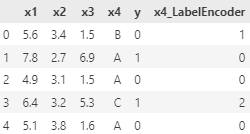
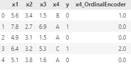
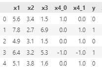
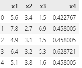
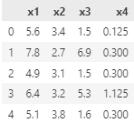
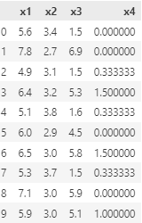
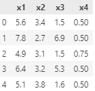

# Encodage efficace des variables catégorielles pour du ML

Les variables catégorielles, on les croise partout dans nos datasets, mais les algorithmes de machine learning, eux, préfèrent les chiffres. Dans ce billet, nous allons explorer plusieurs techniques d'encodage pour transformer ces variables, le tout agrémenté d'explications claires, de formulations mathématiques, et quelques exemples pratiques. Nous aborderons aussi les avantages et les limites de chaque technique, que ce soit les "Classic Encoders", le "Contrast Encoder", ou les "Bayesian Encoders".
<!-- more -->

## Prérequis

Assurez-vous d'avoir pandas, scikit-learn, et category_encoders installés.


Pour illustrer nos exemples, voici un petit jeu de données :

| x1  | x2  | x3  | x4 | y |
|-----|-----|-----|----|---|
| 5.6 | 3.4 | 1.5 | B  | 0 |
| 7.8 | 2.7 | 6.9 | A  | 1 |
| 4.9 | 3.1 | 1.5 | A  | 0 |
| 6.4 | 3.2 | 5.3 | C  | 1 |
| 5.1 | 3.8 | 1.6 | A  | 0 |
| 6.0 | 2.9 | 4.5 | B  | 0 |
| 6.5 | 3.0 | 5.8 | C  | 1 |
| 5.3 | 3.7 | 1.5 | A  | 0 |
| 7.1 | 3.0 | 5.9 | B  | 0 |
| 5.9 | 3.0 | 5.1 | C  | 1 |

Pour modéliser cette table de données, il nous faut transformer la colonne x4 en variable numérique. En gros, nous allons discuter des différentes approches qui s'offrent à nous.

## I. Classic Encoders
### 1. Label Encoding

#### Description
L'encodage par étiquette attribue un entier unique à chaque catégorie d'une variable catégorielle. Cependant, attention ! Cette méthode peut insuffler une notion d'ordre qui pourrait être inappropriée pour des données purement nominales.

#### Expression Mathématique
Pour des catégories $C_1, C_2, \ldots, C_n$, l'encodage se fait comme suit :
$$
\text{Valeur Encodée} = \text{index}(C_i) \quad \text{pour} \; i = 1, 2, \ldots, n
$$
où $\text{index}(C_i)$ représente un entier unique associé à chaque catégorie.

#### Pratiquement
Voici un petit extrait de code :

```python
from sklearn.preprocessing import LabelEncoder
encoder = LabelEncoder()
data["x4_LabelEncoder"] = encoder.fit_transform(data["x4"])
data.head()
```


N’oublions pas l’inconvénient : cela peut introduire des valeurs qui n’ont pas de sens statistique.

### 2. Ordinal Encoder

#### Description
Il arrive que certaines catégories aient un sens d'ordre. Dans ce cas, un Label Encoder ne sera pas très utile et pourrait même causer des dommages dans les données. L'encodage ordinal attribue aussi un entier unique à chaque catégorie, mais cela se fait lorsque les catégories ont un ordre naturel. Pensez à des catégories telles que faible, moyen, et élevé ; cet ordre doit être respecté.

#### Expression Mathématique
Pour des catégories ordonnées $C_1, C_2, \ldots, C_n$ où l'ordre naturel est $C_1 < C_2 < \ldots < C_n$, l'encodage ordinal se fait par : 
$$ 
\text{Valeur Encodée} = \text{position}(C_i) \quad \text{pour} \; i = 1, 2, \ldots, n 
$$ 

où : 
- $\text{position}(C_i)$ représente la position ordinale de la catégorie $ C_i $ dans l'ordre naturel. Si $C_1$ est la première, alors $\text{position}(C_1) = 1$ et ainsi de suite.

#### Pratiquement
Pour une variable catégorielle x4 représentant "Niveau de risque", avec les catégories suivantes :
- C → Faible 
- B → Moyen 
- A → Élevé 

Si l'ordre naturel est *Faible < Moyen < Élevé*, alors l'encodage ordinal sera : 
   - C → 0 
   - B → 1 
   - A → 2

```python
from sklearn.preprocessing import OrdinalEncoder
encoder = OrdinalEncoder(categories=[['C', 'B', 'A']])
data["x4_OrdinalEncoder"] = encoder.fit_transform(data[["x4"]])
data.head()
```


Cette méthode préserve l'ordre des catégories, crucial pour certaines analyses statistiques. En revanche, il faut s'assurer que cet ordre est bien défini dans le code `OrdinalEncoder(categories=[['C', 'B', 'A']])`.

### 3. One-Hot Encoder

#### Description
Ce procédé crée des colonnes binaires, ou indicatrices, pour chaque catégorie. Pour chaque observation, la colonne correspondant à la catégorie présente prend la valeur 1, et les autres sont à 0.

#### Mathématiquement
Soit $C = \{ C_1, C_2, ..., C_n \}$ les catégories d'une variable. Une observation appartenant à $C_i$ est représentée par :
$$
\mathbf{x} = [0, 0, \ldots, 1, \ldots, 0] \quad \text{où la position } i \text{ est à 1}
$$

#### Pratiquement
Il existe plusieurs outils, mais restons simples avec la méthode `get_dummies` de pandas, que je trouve bien pratique.

```python
import pandas as pd
data = pd.get_dummies(data, columns=["x4"], drop_first=False, prefix="x4_OneHotEncoder", dtype=int)
data.head()
```


On peut jouer avec pas mal de paramètres. Pour les modèles statistiques, on a souvent tendance à fixer `drop_first=True` afin d'éviter le problème de colinéarité parfaite. Vous l'avez vu, on a transformé la variable x4 en plusieurs nouvelles caractéristiques. Cela peut poser problème si on a un grand nombre de catégories, ce qui pourrait mener à des matrices creuses. Dans une situation de ML training, cela peut entraîner du surapprentissage. Parfois, une sélection de caractéristiques devient alors inévitable.

https://pandas.pydata.org/docs/reference/api/pandas.get_dummies.html

### Autres encodeurs
Je vous encourage aussi à jeter un œil sur deux encodeurs intéressants :
- [Hashing encoder](https://contrib.scikit-learn.org/category_encoders/hashing.html) 
- [Count encoder](https://contrib.scikit-learn.org/category_encoders/count.html)


## II. Contrast Encoder
Les encodeurs de contraste transforment les variables catégorielles en format numérique en créant des codes de contraste qui permettent aux algorithmes d'interpréter efficacement les resultats des modèles de regression. Voici quelques méthodes courantes pour encoder les contrastes :

### 1. Sum Encoder

#### Description
Cette méthode encode les variables de manière à ce que la somme des vecteurs encodés soit égale à zéro, évitant ainsi la multicolinéarité. Dans un modèle One Hot Encoding, on doit supprimer une catégorie et la garder comme référence. Ainsi :
+ Dans ce modèle, l'intercept représente la moyenne de la condition de référence.
+ Les coefficients représentent les effets simples, c'est-à-dire la différence entre une condition particulière et la condition de référence.

Cela n'est pas toujours du goût des statisticiens ! Ils ont donc introduit l'encodage par somme. Dans les modèles de régression :
+ L'intercept représente la moyenne générale du target à travers toutes les conditions.
+ Les coefficients des catégories sont alors interprétés comme la variation de la moyenne du target pour chaque catégorie par rapport à cette moyenne générale.

#### Mathématiquement
Pour des catégories $C = \{ C_1, C_2, \ldots, C_n \}$, si nous choisissons $C_k$ comme catégorie de référence, une observation appartenant à $C_i$ (où $ i \neq k $) se représente par :

$$
\mathbf{x} = \begin{bmatrix} 1 & 0 & \ldots & -1 & -1 \end{bmatrix}
$$

où les valeurs sont :
-  $1$ pour la catégorie $C_1$ 
-  $1$ pour la catégorie $C_2$ 
-  $-1$ pour la catégorie de référence $C_k$ 
-  $0$ pour les autres catégories.

#### Pratiquement
Pour appliquer l'encodage Sum avec Pandas, on pourrait le faire directement, mais je vous conseille d'utiliser le package category_encoders, notamment la classe [SumEncoder](https://contrib.scikit-learn.org/category_encoders/sum.html).

```python
from category_encoders.sum_coding import SumEncoder
SE_encoder = SumEncoder(drop_invariant=True)
SE_encoder.fit_transform(data).head()
```


Première remarque : il n’y a pas de catégorie de référence, car par défaut, c’est la dernière par ordre alphabétique. On ne peut pas choisir la catégorie de référence directement ici, mais une fois que l’on a compris le principe, on peut s’en charger par nous-mêmes. Pour obtenir les coefficients de la catégorie de référence, il suffit de prendre -1 et -1 pour `x4_0` et `x4_1`.

### 2. Helmert Coding
Pour plus de détails, consultez ce [lien](https://contrib.scikit-learn.org/category_encoders/helmert.html).

## III. Bayesian Target Encoders
Les methodes classées comme Bayesiennes  sont des  technique utile pour encoder les variables catégorielles en tenant compte de la distribution du target. Cette approche intègre des informations a priori sur la variable cible, ce qui la rend particulièrement efficace pour améliorer la performance des modèles d'apprentissage automatique. Leurs Caractéristiques clés sont les suivantes.

1. **Cadre Bayésien** : Cette méthode recourt à l’approche bayésienne pour estimer la moyenne du target pour chaque catégorie tout en considérant les informations provenant de l'ensemble de données global. Cela aide à atténuer les soucis liés au surajustement, surtout quand les catégories ont peu d'observations.

2. **Réduction (Shrinkage)** : L'encodage cible bayésien applique une technique de réduction, où la moyenne de la catégorie est ajustée vers la moyenne générale du target, rendant l'encoding plus robuste.

3. **Gestion des Données Manquantes** : Cette méthode s’accommode bien des données manquantes dans la caractéristique catégorique en fournissant une estimation significative basée sur les données accessibles.

4. **Cas d'Utilisation** : L'encoding cible bayésien est particulièrement préconisé pour les variables catégorielles à forte cardinalité, où l'encoding one-hot entraînerait trop de caractéristiques.

Avant d’explorer les formules, voici quelques notations cruciales :

- $y$ et $y^+$ : Le nombre total d'observations et le nombre total d'observations positives (où $ y = 1 $).
- $x_i, y_i$ : La valeur de la catégorie et du target pour l'observation $ i $.
- $n$ et $n^+$ : Le nombre d'observations et le nombre d'observations positives pour une valeur spécifique d'une colonne catégorielle.
- $a$ : Un hyperparamètre de régularisation.
- $prior$ : La valeur moyenne du target sur l'ensemble du dataset.
-  $x^k_i$ est la valeur encodée pour l'observation $i$ de la catégorie $k$

### 1. Target encoder

Le target encoder est une technique de transformation de variables catégorielles fondée sur la variable cible, souvent utilisée dans les modèles de machine learning supervisé. L'idée est de remplacer chaque catégorie par une valeur calculée à partir de la moyenne du target, avec un mécanisme de lissage pour prévenir le surajustement.

#### Mathématiquement


1. **Calcul du Paramètre de lissage ($s$)**

   Le paramètre de lissage est utilisé pour équilibrer la contribution entre la moyenne générale (prior) et la moyenne par catégorie :
   $$
   s = \frac{1}{1 + \exp\left(-\frac{n - mdl}{a}\right)}
   $$

   où :
      - $mdl$ est la valeur minimale de données par feuille,

2. **Calcul de la valeur encodée ($ \hat{x}^k $)**
   
   La valeur encodée pour chaque catégorie $ k $ est donnée par :
   $$
   \hat{x}^k = prior \cdot (1 - s) + s \cdot \frac{n^+}{n}
   $$

   où :
      - $s$ est le paramètre de lissage calculé,
      - $\frac{n^+}{n}$ est la moyenne des cibles positives pour la catégorie $k$.

#### Pratiquement
On utilisera encore le package category_encoders, avec les valeurs par défaut :


```python
from category_encoders import TargetEncoder
encoder = TargetEncoder()
encoder.fit_transform(data.drop(columns=["y"]), data["y"]).head()
```



| **Avantages**                                    | **Inconvénient**                                   |
|--------------------------------------------------|----------------------------------------------------|
| Capture la relation avec le target : Directement intégrée, permettant d'améliorer la performance. | Surajustement potentiel : Surtout pour les catégories avec peu de données. |
| Réduit la dimensionnalité : Évite une explosion de dimensions comparé à l'encoding one-hot. | Le mécanisme de régularisation aide, mais nécessite un bon ajustement des hyperparamètres pour éviter le surapprentissage. |
| Gère les catégories rares : Le lissage minimise le risque de surajustement pour les valeurs peu fréquentes. |                                                    |
| Facile à interpréter : Les valeurs encodées reflètent des probabilités moyennes pondérées, simplifiant l'analyse. |                                                    |


### 2. M-Estimate coding

L'M-Estimate encoder est une version simplifiée du target encoder qui a un seul paramètre de lissage, ce qui facilite sa mise en place et son ajustement. Conçu pour estimer la probabilité d'appartenance à une catégorie en utilisant une moyenne pondérée.

#### Description
M-Estimate coding est une technique simplifiée qui utilise un seul paramètre de lissage, facilitant son adaptation. Il est destiné à estimer la probabilité d'appartenance à une catégorie en s'appuyant sur une moyenne pondérée.

#### Mathématiquement
La formule de  M-Estimate coding est :

$$
\hat{x}^k = \frac{n^+ + \text{prior} \cdot m}{n + m}
$$

où :
   - $m$ : paramètre de lissage.

#### Pratiquement
Voici comment on peut implémenter ce type d'encoding en Python :

```python
from category_encoders import MEstimateEncoder
encoder = MEstimateEncoder()
encoder.fit_transform(data.drop(columns=["y"]), data["y"]).head()
```


#### Avantages et inconvénients

| **Avantages**                                    | **Inconvénients**                                    |
|--------------------------------------------------|-----------------------------------------------------|
| Simple et efficace : Un seul paramètre de lissage à ajuster. | Régularisation limitée : Moins flexible que le target encoder classique. |
| Réduction du surajustement : Le paramètre $ m $ stabilise les valeurs, réduisant l'impact des catégories rares. | Pas idéal pour les cibles catégorielles multiples : Un wrapper polynomial est nécessaire, complexifiant la méthode. |
| Performance élevée : Pratique à implémenter et efficace pour les cibles binaires et continues. |                                                     |


### 3. Leave-One-Out encoder
Le Leave-One-Out encoder (LOO) est une autre méthode tirée de target encoder, mais avec une variation importante pour minimiser la fuite d'information.

#### Description
L'idée est de calculer la moyenne du target pour chaque catégorie, mais sans inclure l'observation actuelle. Cela aide à limiter la fuite d'information puisque la valeur cible de l'observation en cours n'est pas intégrée dans sa propre transformation.

#### Mathématiquement

Le calcul se fait en deux etapes.


1. Calcul de la moyenne du target en excluant l'observation actuelle

   Pour chaque observation $ i $ appartenant à la catégorie $ k $, la moyenne est calculée sans l’observation en cours par :
   $$
   x^k_i = \frac{\sum_{j \neq i} (y_j \cdot (x_j == k)) - y_i}{\sum_{j \neq i} (x_j == k)}
   $$

   En excluant $ y_i $, on évite que le modèle "voit" sa propre valeur cible, ce qui réduit le risque de surapprentissage.

2. **Encodage des données de test**

   Pour les données de test, chaque catégorie est remplacée par la moyenne du target calculée sur l'ensemble des données d'entraînement :
   $$
   x^k = \frac{\sum y_j \cdot (x_j == k)}{\sum (x_j == k)}
   $$

#### Pratiquement

```python
import pandas as pd
from category_encoders import LeaveOneOutEncoder
encoder = LeaveOneOutEncoder()
encoder.fit_transform(data.drop(columns=["y"]), data["y"])
```


Décomposons le calcul pour chaque observation dans la colonne `x4` :

Nous allons expliquer les calculs dans le tableau ci-dessous pour les trois premières lignes : Calculer la moyenne du target pour chaque catégorie en excluant l'observation actuelle. La valeur trouvée est la nouvelle valeur.


| Index | Catégorie | Cibles (sans l'observation actuelle) | Moyenne du target        |
|-------|-----------|--------------------------------------|---------------------------|
| 0     | B         | [0, 0]                               | $\frac{0 + 0}{2} = 0$     |
| 1     | A         | [0, 0, 0]                           | $\frac{0 + 0 + 0}{3} = 0$ |
| 2     | A         | [1, 0, 0]                           | $\frac{1 + 0 + 0}{3} \approx 0.33$ |

Si tu as besoin de modifications ou d'ajouts, n'hésite pas à me le faire savoir !
Chaque observation est maintenant encodée avec la moyenne des cibles des autres observations de la même catégorie.


| **Avantages**                                    | **Inconvénients**                                    |
|--------------------------------------------------|-----------------------------------------------------|
| Réduction de la fuite d'information : Sa méthode minimise les risques de biais. | Complexité : Peut être coûteux en calculs sur de grands ensembles de données. |
| Capture des relations complexes : Comme target encoder, utile pour des relations non linéaires. | Variabilité : Peut introduire de la variance avec de petites catégories, nécessitant une régularisation supplémentaire. |


### 5. James-Stein encoding

#### Description
L'encoding James-Stein est un encodeur basé sur des cibles. Son idée fondatrice est d'estimer la moyenne du target pour une catégorie donnée $ k $ selon la formule suivante :

$$
JS_i = (1-B) \cdot \text{mean}(y_i) + B \cdot \text{mean}(y)
$$

où : 
   - $JS_i$ est l’estimation pour la catégorie $C_i$,
   - $\text{mean}(y_i)$ est la moyenne des valeurs cibles pour la catégorie $C_i$,
   - $\text{mean}(y)$ est la moyenne générale des cibles,
   - $B$ est un poids calculé qui équilibre l’influence de la moyenne conditionnelle et de la moyenne globale.

Cela semble très sensé. Nous cherchons une estimation qui se situe entre la moyenne de l'échantillon (risquant d'être extrême) et la moyenne globale.

#### Mathématiquement
Le poids $ B $ est défini par :

$$
B = \frac{\text{var}(y_i)}{\text{var}(y_i) + \text{var}(y)}
$$

On se demande quel devrait être ce poids. Si on accorde trop de poids à la moyenne conditionnelle, on risque le surajustement, tandis qu'en privilégiant la moyenne globale, on peut sous-ajuster. Une approche canonique en apprentissage machine serait de passer par une validation croisée. Cependant, Charles Stein a proposé une solution en forme fermée. L'idée : ajuster la qualité des estimations selon la variance.

Cet estimateur est limité aux distributions normales, ce qui ne convient pas à toutes les tâches de classification. Ainsi, on retrouve :

$$
SE^2 = \frac{\text{var}(y)}{\text{count}(y)}
$$

Un défi majeur est que nous ne connaissons pas $\text{var}(y)$. Il nous faudra donc estimer ces variances. Voici quelques solutions :

1. **Modèle Pooled** : Si toutes les observations sont semblables et prennent un nombre commun d'observations pour chaque valeur.

2. **Modèle Indépendant** : Si les comptes d'observation diffèrent, il est plus judicieux de remplacer les variances par des erreurs standard, pénalisant ainsi les petites observations :

$$
SE^2 = \frac{\text{var}(y)}{\text{count}(y)}
$$

#### Application pour la classification binaire

Cet estimateur a une limitation pratique dans les modèles de classification binaire, où les cibles ne sont que $0$ ou $1$. Pour l'appliquer, on doit convertir lamoyenne du target dans l'intervalle borné $<0,1>$ en remplaçant $\text{mean}(y)$ par le ratio des cotes logarithmique :

$$
\text{log-odds\_ratio}_i = \log\left(\frac{\text{mean}(y_i)}{\text{mean}(y_{\text{not} \, i})}\right)
$$

Cela s'appelle **modèle binaire**. C’est délicat d'estimer les paramètres de ce modèle, et parfois cela échoue. Il est souvent plus judicieux de recourir à un **modèle bêta**, souvent plus stable malgré une précision légèrement inférieure.

#### Pratiquement

Pour utiliser l'encodeur James-Stein, allez-y avec la classe `JamesSteinEncoder` de `category_encoders` :

```python
import pandas as pd
from category_encoders import JamesSteinEncoder

encoder = JamesSteinEncoder()
encoder.fit_transform(data.drop(columns=["y"]), data["y"])
```


### 4. CatBoost Encoding


#### Description
Il s'agit  d'une méthode d'encodage basée sur la cible, développée à l'origine pour être utilisée avec l'algorithme CatBoost, mais qui est applicable à d'autres modèles. Cet encodeur utilise une méthode particulière pour éviter la fuite d'information tout en exploitant les relations entre les catégories et ld target y.


L'idée principale est d'utiliser les informations du target de manière ordonnée. Plutôt que de déterminer la moyenne du target pour chaque catégorie sur l'ensemble des données (qui peut introduire des fuites), CatBoost effectue une mise à jour de l'encodage de manière **séquentielle**.

#### Mathématiquement

Le calcul se fait en deux etapes.

1. Ordre des observations
   - L'algorithme parcourt les données de manière ordonnée.
   - L'encodage pour chaque observation est basé sur les informations des observations **précédentes** seulement, empêchant ainsi la valeur du target actuelle d'affecter son propre encodage.

2. Calcul progressif de la moyenne du target
   - Pour chaque observation $i$ dans la catégorie $ k $, la moyenne du target est calculée avec les observations **précédentes**. La formule est :
   $$
   x^k_i = \frac{\sum_{j < i} (y_j \cdot (x_j == k)) + \text{prior} \cdot \alpha}{\sum_{j < i} (x_j == k) + \alpha}
   $$
   

3. Encodage des données de test
   - Pour les données de test, l'encodage est basé sur les moyennes calculées à partir des données d'entraînement, sans fuite d'information.

#### Pourquoi CatBoost encoder est-il Efficace ?

CatBoost encoder réduit efficacement la fuite d'information grâce à sa méthode de calcul séquentiel. Voici quelques atouts :
- **Séquentiel et Progressif** : En n'utilisant que les observations précédentes, il évite que la valeur actuelle influence son encodage.
- **Régularisation** : L'ajout d'un terme de régularisation permet de contrôler la variance.

#### Pratiquement

```python
from category_encoders import CatBoostEncoder
encoder = CatBoostEncoder()
encoder.fit_transform(data.drop(columns=["y"]), data["y"]).head()
```


Et voilà ! Pour appliquer l'encodeur CatBoost à la variable catégorielle `x4`, nous avons vu le calcul étape par étape. 

## Conclusion

Le choix de la meilleure méthode dépendra de votre cas d'utilisation et de la cardinalité des catégories. Est-on à la recherche d'un modèle explicatif ou prédictif ?  Dans le billet de blog de la semaine prochaine, je vais essayer de mesurer les performances de ces méthodes avec un modèle simple et voir qui s’en sort le mieux.

