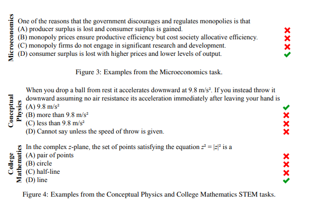
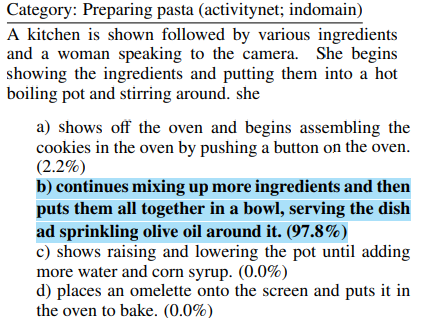
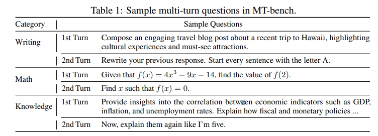

# Évaluer les Capacités des LLMs : les benchmarks

Les modèles de langage (LLMs) ont réalisé des avancées spectaculaires dans des tâches variées, telles que la rédaction, la conversation, et la programmation.
Pour évaluer et comparer efficacement leur intelligence, divers benchmarks sont utilisés, mesurant des capacités allant des connaissances académiques (comme MMLU) au raisonnement complexe (GPQA), en passant par des compétences spécifiques telles que les mathématiques de base (GSM8K) ou la génération de code (HumanEval). 

<!-- more -->

Ces évaluations permettent de mieux cerner la portée des capacités des LLMs, bien que certains benchmarks se concentrent encore principalement sur des questions fermées avec des réponses courtes, limitant ainsi une évaluation complète de leurs aptitudes.

Pour mieux comprendre comment les LLMs se comparent entre eux, il est essentiel d'examiner ces benchmarks en détail. Le tableau ci-dessous, illustre une comparaison des performances de leur modèle Claude face à d'autres LLMs leaders :
  
*Source : [Site Anthropic](https://www.anthropic.com/news/claude-3-family)*

## Concepts clées :
- **SOTA (State-of-the-Art) :** Se réfère aux modèles, algorithmes ou techniques les plus performants actuellement dans un domaine d'étude spécifique.
- **STEM :** Acronyme pour Science, Technology, Engineering, and Mathematics, représentant des disciplines clés souvent utilisées pour tester les capacités des LLMs en matière de compréhension et de raisonnement scientifique.

## Les Principaux Benchmarks pour Évaluer les LLMs

### 1. **MMLU (Massive Multitask Language Understanding)**

- **Publication :** 2021
- **Liens :** [Code](https://github.com/hendrycks/test) | [Dataset](https://huggingface.co/datasets/lukaemon/mmlu) | [Papier](https://arxiv.org/abs/2009.03300)

Le MMLU évalue les modèles en se basant sur les connaissances acquises lors de la pré-formation, en se concentrant sur les réglages zéro-shot et few-shot. Ce benchmark couvre 57 sujets, incluant les STEM, les sciences humaines et sociales, avec des niveaux de difficulté allant de l'élémentaire à l'avancé. 

- **Type de données :** Questions à choix multiples
- **Critère de scoring :** Proportion de réponses correctes exactes (par exemple, 'A', 'B', etc.).
- **Environnement d'évaluation :** Conçu pour des configurations zéro-shot et few-shot pour tester les capacités générales des LLMs sans ajustement spécifique aux tâches.

*Source : [Papier original MMLU](https://arxiv.org/abs/2009.03300)*

### 2. **HellaSwag**

- **Publication :** 2019
- **Liens :** [Code](https://github.com/rowanz/hellaswag) | [Dataset](https://huggingface.co/datasets/Rowan/hellaswag) | [Papier](https://arxiv.org/abs/1905.07830)

HellaSwag évalue les capacités de raisonnement des LLMs à travers des tâches de complétion de phrases. Il teste si les modèles peuvent sélectionner la fin appropriée parmi un ensemble de quatre choix pour 10 000 phrases. 

- **Métrique utilisée :** Proportion de réponses correctes exactes.
- **Spécificité :** Met l'accent sur le raisonnement de bon sens, un domaine où de nombreux modèles échouent encore.
- **Structure des tâches :** Les tâches sont des complétions de phrases où les choix sont construits de manière à sembler plausibles pour tester les limites du modèle.

*Source : [Papier original HellaSwag](https://arxiv.org/abs/1905.07830)*

### 3. **BIG-Bench Hard (Beyond the Imitation Game Benchmark)**

- **Publication :** 2022
- **Liens :** [Code](https://github.com/suzgunmirac/BIG-Bench-Hard) | [Dataset](https://huggingface.co/datasets/maveriq/bigbenchhard) | [Papier](https://arxiv.org/abs/2210.09261)

BIG-Bench Hard sélectionne 23 tâches difficiles du [BIG-Bench suite](https://github.com/google/BIG-bench), un ensemble diversifié de 204 tâches conçues pour dépasser les capacités des modèles de langage. 

- **Caractéristiques uniques :** Inclut des tâches qui dépassent les capacités des modèles de langage actuels, nécessitant souvent un raisonnement avancé ou des réponses multi-pas.
- **Méthodologie :** Utilisation de Chain-of-Thought (CoT) prompting pour améliorer les performances des LLMs sur des tâches complexes.

### 4. **HumanEval**

- **Publication :** 2021
- **Liens :** [Code](https://github.com/openai/human-eval) | [Dataset](https://paperswithcode.com/dataset/humaneval) | [Papier](https://arxiv.org/abs/2107.03374)

HumanEval consiste en 164 tâches de programmation uniques pour évaluer les capacités de génération de code des modèles. Ces tâches couvrent un large spectre, des algorithmes à la compréhension des langages de programmation. 

- **Types de tâches :** Algorithmes, manipulation de données, compréhension syntaxique.
- **Métrique d'évaluation :** Capacité du modèle à générer du code correct sans intervention humaine. Les sorties doivent être correctes au premier essai.

### 5. **MT-Bench**

- **Publication :** 2021
- **Liens :** [Code](https://github.com/lm-sys/FastChat/blob/main/fastchat/llm_judge/README.md) | [Dataset](https://huggingface.co/spaces/lmsys/mt-bench) | [Papier](https://arxiv.org/pdf/2306.05685v4.pdf)

MT-Bench évalue la qualité des assistants de chat en les soumettant à une série de questions ouvertes et multi-turn, en utilisant des LLMs comme juges. 

- **Structure :** 80 questions multi-turn pour évaluer la conversation et le suivi d'instructions.
- **Critère de scoring :** Utilise GPT-4 pour noter chaque interaction sur une échelle de 1 à 10. Le score final est la moyenne de toutes les évaluations.

*Source : [Papier original MT-Bench](https://arxiv.org/pdf/2306.05685v4.pdf)*

### 6. **DROP (Discrete Reasoning Over Paragraphs)**

- **Publication :** 2019
- **Liens :** [Code](https://github.com/allenai/drop) | [Dataset](https://huggingface.co/datasets/drop) | [Papier](https://arxiv.org/abs/1903.00161)

DROP teste les capacités des LLMs à effectuer des raisonnements complexes et discrets en fonction des informations contenues dans un paragraphe. Les tâches incluent des questions nécessitant des calculs, des comparaisons et des extractions de texte.

- **Type de données :** Questions à réponse ouverte nécessitant des calculs ou des comparaisons.
- **Critère de scoring :** Utilisation du F1 Score, qui combine la précision et le rappel pour mesurer la capacité des modèles à générer des réponses exactes.

*Source : [Papier original MT-Bench](https://arxiv.org/pdf/2306.05685v4.pdf)*

## Conclusion

Les benchmarks comme MMLU, HellaSwag, BIG-Bench Hard, HumanEval, MT-Bench, DROP et l'utilisation du F1 Score offrent des évaluations précieuses pour mesurer les capacités des LLMs dans divers domaines tels que la compréhension du langage, le raisonnement, la programmation et la conversation. Ces benchmarks, combinés à des scores et métriques spécifiques, aident à identifier les forces et les faiblesses des modèles, ouvrant ainsi la voie à des améliorations continues dans le domaine des LLMs.

## Références:
https://github.com/leobeeson/llm_benchmarks