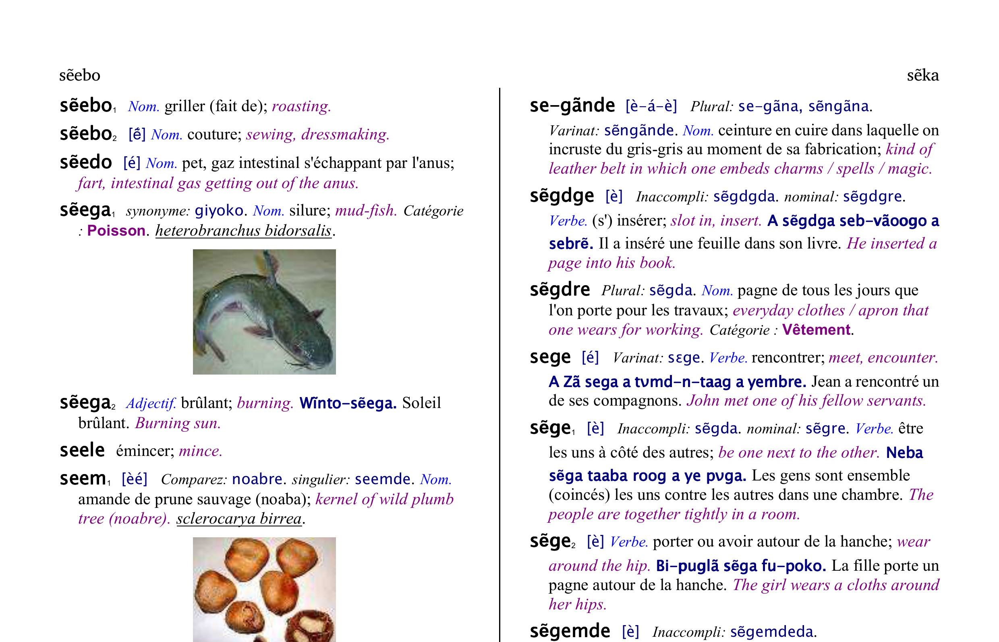
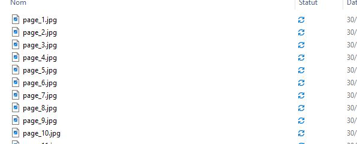
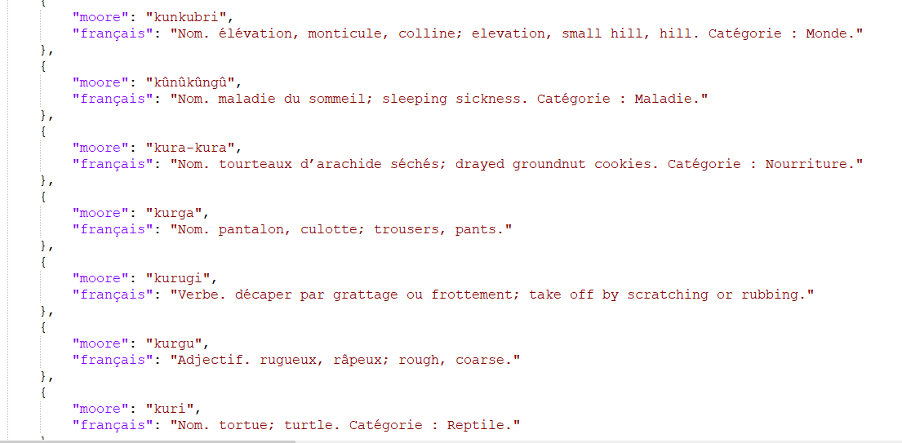

# Adieu OCR, Place aux LLM Multimodaux pour l'Extraction des Informations dans les Documents  

## Introduction  

Les formats comme **PDF**, **Word** ou **PowerPoint** sont omniprésents pour le partage de documents, mais dès qu’il s’agit d’extraire des données structurées ou de gérer des contenus complexes, c’est une toute autre histoire.  

Ceux qui se sont déjà aventurés dans ces tâches connaissent la frustration des outils traditionnels comme `PDFium`, `pypdf` ou `textract`. Bien que pratiques pour des besoins basiques, ces solutions montrent vite leurs limites face aux documents denses, aux tableaux imbriqués, ou au texte qui se chevauche.  

Mais les temps changent. Avec l’arrivée des **LLM multimodaux**, les choses s'améliorent drastiquement. Ces modèles permettent non seulement de traiter des fichiers comme des **PDF**, **PPTX** ou **Word**, qu’ils soient purement textuels ou visuels, mais offrent également la possibilité de personnaliser l’extraction. Par exemple, vous pouvez demander un formatage précis des données extraites.  

Dans cet article, je vous propose de découvrir comment les LLM multimodaux révolutionnent cette tâche autrefois laborieuse, en rendant les processus non seulement plus simples mais aussi plus abordables. 
**Allons-y !**

<!-- more -->

## I. OCR et Défis 

Avant d’aller loin, voici un aperçu d’une page d’un document que je traite (plus de **320 pages** au total). Mon objectif est simple mais ambitieux : extraire pour chaque mot en **mooré** son équivalent ou explication associée en **français**.  

  

Quand il s’agit de documents simples, l’extraction de texte est faisable sans trop de souci. Mais dès qu’on passe à des documents complexes, les vrais défis apparaissent :  
1. **Détection des structures hasardeuse** : les tableaux, colonnes et sections imbriquées deviennent illisibles pour certains outils.  
2. **Multi-langues** : le contenu en plusieurs langues pose problème à de nombreux OCR, surtout lorsqu'il mélange des langues locales et internationales.  
3. **Fiabilité limitée** : beaucoup d'OCR ajoutent du bruit au lieu d’apporter des résultats propres et exploitables.  

Au vu de ces limitations, j’ai vite abandonné la solution **OCR classique** pour mon projet.


## II. Une solution gagnante : les LLM multimodaux  

### Processus simplifié

```mermaid  
graph LR;  
    A["PDF brut"] -->|Convertir en images| B[Images]  
    B -->|Encodage en Base64| C[Images encodées]  
    C -->|Envoyer au modèle| D[LLM multimodal]  
    D -->|Extraction des informations| E[JSON structuré]  
    E -->|Sauvegarde des résultats| F[(Base de données)]  
```

Ce diagramme illustre parfaitement pourquoi cette approche est moins fastidieuse. Grâce aux **LLM multimodaux**, même les tâches complexes, comme celle-ci, deviennent gérables en si peu de temps. Par exemple, **GPT-4o** ou **GPT-4o-mini** excelle dans ce genre de traitement.

👉 *Pourquoi c’est gagnant ?*  
- **Meilleure compréhension des structures** : les tableaux et sections imbriquées sont correctement analysés.  
- **Prise en charge multilingue** : les LLM reconnaissent les langues locales et internationales sans trop de pertes.  
- **Résultats propres** : moins de bruit et plus d'informations directement exploitables.  

Avec cette stratégie, chaque page est traitée avec précision, et les données sont prêtes à être utilisées pour alimenter ma base de traduction mooré-français.

### Estimation du coût par page  

D'après la documentation d'OpenAI(*gpt vision*), chaque image est redimensionnée si nécessaire pour s'adapter à un carré de 1024x1024 pixels, générant ainsi 85 tokens de base. Mais pour des images complexes, le modèle procède différemment : il les divise en tuiles de 512x512 pixels pour une reconnaissance complète. Tu peux trouver plus de détails [ici](https://community.openai.com/t/how-do-i-calculate-image-tokens-in-gpt4-vision/492318/3).

**Comment les tuiles affectent le coût ?**  

Chaque tuile génère 170 tokens. Donc, la formule de calcul est simple :  
**Total tokens = 85 + 170 * n**, où **n** représente le nombre de tuiles nécessaires pour couvrir l'image.

Voici une fonction Python qui illustre cela :  

```python  
from math import ceil  

def resize(width, height):  
    if width > 1024 or height > 1024:  
        if width > height:  
            height = int(height * 1024 / width)  
            width = 1024  
        else:  
            width = int(width * 1024 / height)  
            height = 1024  
    return width, height  

def count_image_tokens(width: int, height: int):  
    width, height = resize(width, height)  
    h = ceil(height / 512)  
    w = ceil(width / 512)  
    total = 85 + 170 * h * w  
    return total  
```

**Exemples pour clarifier :**  
- **500x500** → 1 tuile suffit : total tokens = 85 + 170 = **255**  
- **513x500** → 2 tuiles : total tokens = 85 + 170 * 2 = **425**  

Dans mon cas, mes images mesurent **2480 x 3509**, ce qui nécessite environ **4 tuiles**, soit **780 tokens**.

Cependant, le texte contenu dans une page dépasse généralement 780  tokens. Regarde ce qui suit :  

```markdown  
1 paragraphe ≈ 100 tokens  
1 500 mots ≈ 2048 tokens  
```  
Source : [OpenAI Help](https://help.openai.com/en/articles/4936856-what-are-tokens-and-how-to-count-them)

Avec mes pages, qui contiennent plusieurs paragraphes, on dépasse largement les **780 tokens** d'une image seule . Convaincu maintenant ?
 J'ai inclus ces calculs pour bien montrer comment le comptage des tokens fonctionne.

**Coût estimé avec GPT-4o :**  
- **Entrée** : Environ 1 300 tokens (image + instruction).  
- **Sortie** : Environ 900 tokens.  
- **Coût** : **0,002 $ par image**.  

Tout ceci pour montrer qu'il est crucial de bien évaluer le coût avant de traiter un volume important de documents ! 😉


## III. Conversion PDF en images  

Bon, Arrêtons les calculs maintenant hahaah. Pour convertir des PDF en images, nous avons besoin d’un outil nommé **Poppler**.

**Poppler** est une bibliothèque gratuite et open-source pour le rendu des documents PDF, soutenue par freedesktop.org.  

### Pré-requis  
1. Installer **Poppler** :  
   Téléchargez [Poppler pour Windows](https://github.com/oschwartz10612/poppler-windows/releases/) et ajoutez son *chemin* dans vos variables d’environnement.  

2. Installer **pdf2image** avec pip :  
   ```bash  
   pip install pdf2image  
   ```  

### Code Python  
Voici comment convertir un PDF en images JPEG :  
```python  
from pdf2image import convert_from_path  

pdf_path = "./Dictionnaire.pdf"  
output_folder = "./images"  

print("Début de la conversion...")  
images = convert_from_path(pdf_path, dpi=300, output_folder=output_folder, fmt='jpeg')  

for i, image in enumerate(images):  
    image.save(f"{output_folder}/page_{i + 1}.jpg", "JPEG")  
    print(f"Page {i + 1} sauvegardée.")  
```  
Ce bout de code transforme toutes les pages en images.  
Quand tu ouvres ton dossier de sortie, tu devrais voir quelque chose comme ceci :  



Voici la version corrigée avec les erreurs grammaticales et d'orthographe corrigées :


## IV. Extraction d’informations avec un LLM  

Maintenant que nous avons les documents, comment récupérer les informations qui nous intéressent ? Toutes les étapes sont dans l'illustration ci-dessous :

```mermaid
flowchart LR
    A[Départ : Image] --> B[Encoder en Base64]
    B --> C[Créer un prompt]
    C --> D[Appeler l'API OpenAI en boucle ou asynch]
    D --> E[Réponse structurée LLM]
    E --> F[Parser la réponse]
    F --> G[Structure Python]
    G --> H[(Persister/Load)]
```

### Étape 1 : Encoder en base64  

Le modèle doit être capable de traiter les images, mais l’API ne permet pas d'envoyer des fichiers d’images directement. C’est pourquoi on utilise le format **base64** pour convertir l’image en une chaîne de texte que le modèle pourra comprendre.  

```python  
import base64  

def convert_image_to_base64(image_path: str) -> str:  
    """Encode une image en une chaîne base64."""  
    with open(image_path, "rb") as f:  
        return base64.b64encode(f.read()).decode("utf-8")  
```  

> **Résumé** : Cette fonction ouvre l’image, la lit en mode binaire, puis la transforme en une chaîne base64. Cette chaîne est ensuite utilisée pour communiquer avec le modèle.

### Étape 2 : Prompt engineering  

Pour que le modèle comprenne que nous lui envoyons une image, il faut l’indiquer clairement dans le prompt. 

```python  
def create_prompt_for_dictionary(base64_image: str) -> List[dict]:  
    """Crée un prompt adapté pour extraire des données structurées."""  
    instruction = """  
    Tu es un système conçu pour extraire les connaissances de documents. Le document contient un dictionnaire Moore-Français.  
    Retourne les entrées au format XML-like tag <output>...</output>. Pour chaque mot, inclut les explications détaillées.  
    Ignore les parties anglaises et conserve les symboles spéciaux.  
    """  
    return [  
        {  
            "role": "user",  
            "content": [  
                {"type": "text", "text": instruction},  
                {"type": "image_url", "image_url": {"url": f"data:image/jpg;base64,{base64_image}"}}  
            ],  
        }  
    ]  
```  

**À retenir** : 

1. Le prompt indique clairement que le document contient des mots en Mooré accompagnés de leur traduction en français à extraire. J’ajoute aussi un exemple de réponse attendue pour guider le LLM efficacement.  
2. La réponse est demandée dans un format structuré avec des balises `<output>...</output>`.  
3. L’image encodée est encapsulée dans une balise `"image_url"`, ce qui permet au modèle de comprendre qu’il s’agit bien d’une image.  
4. Ne t'attarde pas trop sur la finesse du prompt 😅, il n’est pas super élégant, je l’avoue !  
5. Par choix personnel, je n’ai pas utilisé de **système prompt**, uniquement un **query prompt**. Pour les images, il est nécessaire de spécifier le type avec `{"type": "image_url", ...}`, une exigence spécifique qui ne s’applique pas aux cas standards.  


### Étape 3 : Appel à l’API OpenAI  
On utilise l’API OpenAI pour interroger le modèle. Le modèle est configuré pour répondre en respectant les instructions et en générant une réponse structurée.  

```python  
import openai  

openai.api_key = "sk-xxxxxxxxxxxxxxxx"  

def get_llm_response(base64_image: str, model_name: str = "gpt-4o") -> str:  
    """Appelle l'API OpenAI avec une image encodée."""  
    messages = create_prompt_for_dictionary(base64_image)  
    response = openai.ChatCompletion.create(  
        model=model_name,  
        messages=messages,  
        max_tokens=8000,  
    )  
    return response["choices"][0]["message"]["content"]  
```  

> **Résumé** :  
- L’image encodée, accompagnée des instructions, est transmise au modèle via l’API.  
- En retour, le modèle fournit une réponse qui peut contenir des mots en Mooré et leurs traductions.  

Un point intéressant à noter est la possibilité de réaliser des appels asynchrones avec `openai.ChatCompletion.acreate`. Cette méthode permet de traiter plusieurs requêtes en parallèle, ce qui est idéal pour un grand volume d’images. Cependant, j’ai préféré une approche plus simple dans mon cas. Pourquoi ? Parce que j’avais le temps 😄 et, honnêtement, jongler avec des `await` dans mes fonctions, ce n’est pas trop mon truc !


### Étape 4 : Parsing et sauvegarde  

Avec les LLM, le formatage des réponses n’est pas toujours parfait. Pourtant, une stratégie simple et efficace consiste à utiliser des balises XML pour structurer les réponses. En pratique, une expression régulière permet d’extraire uniquement ce qui se trouve entre des balises spécifiques comme `<output>...</output>`. Cela résout les problèmes où le modèle ajoute du texte ou des explications inutiles avant le contenu pertinent.  

Voici une implémentation typique :  

```python  
import re  
import ast  
from typing import Optional, List  

def extract_output(text: str, tag: str) -> Optional[str]:  
    """Extrait le contenu entre balises XML."""  
    pattern = fr"<{tag}>(.*?)</{tag}>"  
    matches = re.findall(pattern, text, re.DOTALL)  
    return matches[0] if matches else None  

def parse_page_with_gpt(image_path: str, model_name: str = "gpt-4o") -> Optional[List[dict]]:  
    """Processus complet : encoder une image, appeler le LLM et parser le résultat."""  
    image_base64 = convert_image_to_base64(image_path)  
    llm_output = get_llm_response(image_base64, model_name)  
    clean_output = extract_output(llm_output, "output")  
    return ast.literal_eval(clean_output) if clean_output else None  
```  

1. **Extraction XML** :  
   - L’utilisation de balises comme `<output>` garantit que seules les données importantes sont extraites.  
   - Le module `re` aide à identifier ces sections en utilisant des motifs précis (ici, le contenu entre `<output>` et `</output>`).  

2. **Parsing Python** :  
   - Une fois le texte brut extrait, il est souvent encore au format chaîne de caractères.  
   - `ast.literal_eval` le transforme en un objet Python (liste ou dictionnaire), ce qui facilite son utilisation ultérieure.  

3. **Encapsulation complète** :  
   - La fonction `parse_page_with_gpt` combine toutes les étapes, de l’encodage de l’image à la récupération des données, dans un processus fluide et réutilisable.  

> **Astuce** : Pour des projets plus avancés(fine-tuning), explorez **[Outlines](https://github.com/OpenLLM/Outlines)**. Cet outil est parfait pour générer des parseurs robustes et bien formatter les resultats selon un schema demandé.  

Avec cette approche, vous vous assurez d’une extraction propre et fiable, même dans des scénarios où les LLM génèrent des réponses un peu "bavardes".

Voici à quoi ressemble ma sortie : 
  

## Conclusion  

Avec leur capacité à comprendre et interpréter des formats variés, les **LLM multimodaux** offrent une solution élégante pour l’extraction de données complexes, tout en réduisant considérablement les coûts. L’approche repose sur un pipeline efficace :  
1. Conversion des documents en images.  
2. Encodage en **Base64**.  
3. Utilisation d’un **prompt structuré**.  
4. Parsing précis pour produire des données structurées.  

En quelques lignes de code, vous pouvez transformer des centaines de pages en données directement exploitables, éliminant ainsi les frustrations des solutions classiques.  

**Et toi, quelles sont tes astuces pour extraire des données structurées à partir de documents complexes ?** 😊