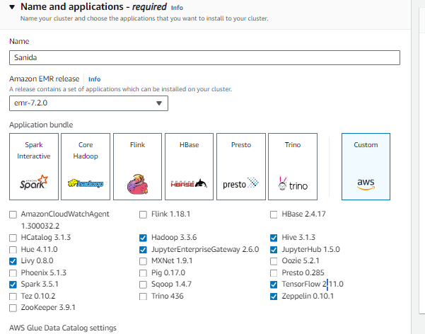
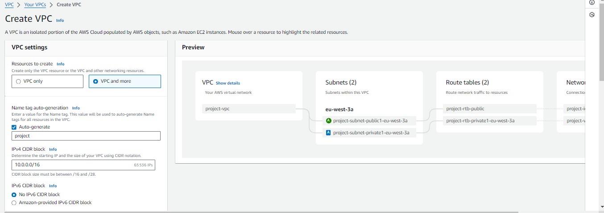
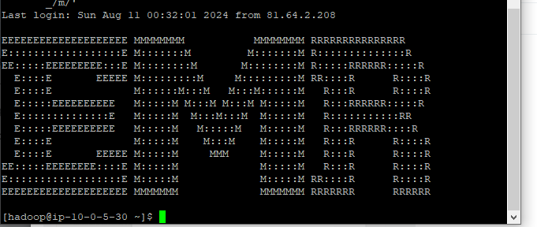
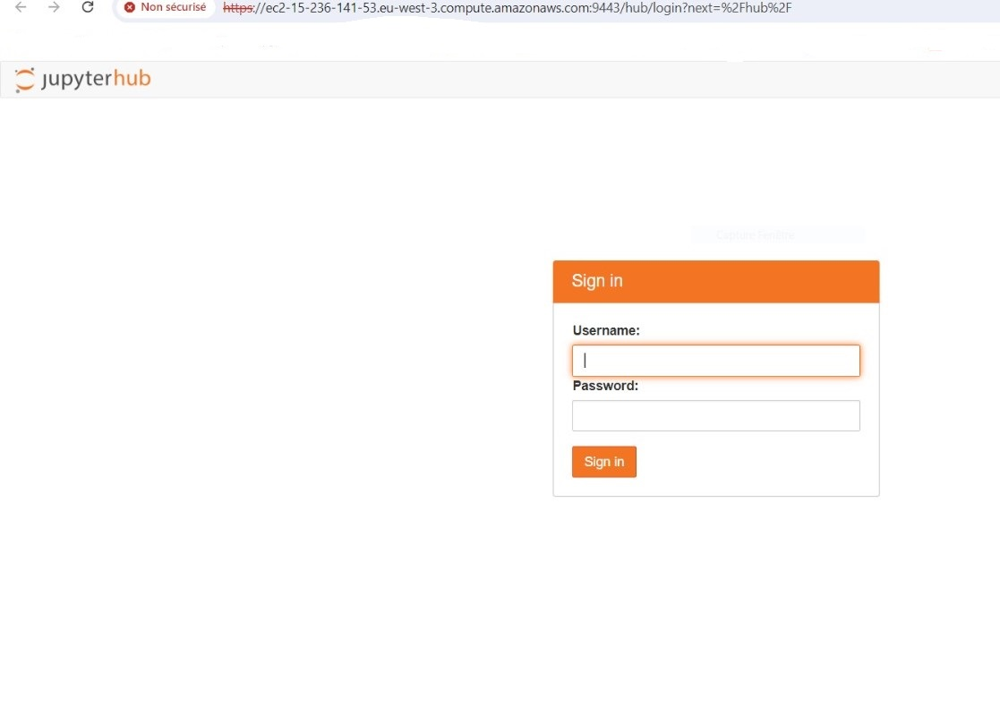

# Comment Créer et Configurer un Cluster Amazon EMR sur EC2


Créer un cluster EMR (Elastic MapReduce) sur EC2 peut sembler complexe, surtout si vous vous lancez pour la première fois. Dans cet article, je vais vous guider à travers chaque étape, depuis la création des rôles jusqu’à la connexion à JupyterHub via un tunnel SSH. Ce guide est conçu pour vous fournir des explications claires et détaillées afin que vous puissiez configurer votre cluster sans difficulté. Nous nous concentrerons spécifiquement sur EMR sur EC2. La petite histoire est que j'ai passé des heures à expliquer cela à plusieurs étudiants intéressés par EMR. J'ai donc décidé de rédiger cet article pour aider un plus grand nombre de personnes à comprendre et à configurer un cluster EMR de manière efficace. EMR ne faisant pas partie des services gratuit du compte tier, il faut prevoir entre 1 à 5 euros de facture sur aws.
<!-- more -->


## 1. Créer un Rôle EMR avec les Permissions Nécessaires

### Pourquoi est-ce important?

Avant de pouvoir créer un cluster EMR, vous devez configurer les rôles et permissions nécessaires pour permettre à Amazon Web Services (AWS) de gérer votre cluster en toute sécurité. Ces rôles permettent à votre cluster d’interagir avec d'autres services AWS comme S3, EC2, et EMR lui-même.

### Étape 1: Création d'un Rôle EMR pour EC2

1. **Accéder à la console IAM:**
   Connectez-vous à votre compte AWS et rendez-vous sur la console IAM. IAM (Identity and Access Management) est l'endroit où vous gérez les permissions et les rôles pour vos services AWS.

2. **Créer un nouveau rôle:**
   - Cliquez sur **Rôles** dans le menu de gauche, puis sur **Créer un rôle**.
   - Sélectionnez **EMR** comme type de rôle, puis choisissez **EC2** comme service. Cela signifie que vous créez un rôle qui sera utilisé par les instances EC2 dans votre cluster EMR.

3. **Ajouter les politiques de permissions:**
   - **AmazonS3FullAccess** : Permet à votre cluster de lire et d’écrire dans des buckets S3, essentiel pour stocker les données et les journaux de votre cluster.
   - **AmazonEC2FullAccess** : Permet à EMR de gérer les instances EC2 (démarrage, arrêt, configuration).
   - **AmazonElasticMapReduceFullAccess** : Donne à EMR un accès complet pour gérer toutes les opérations liées à votre cluster.

Lorsque vous configurerez votre cluster, sélectionnez ce rôle sous **EC2 instance profile** pour permettre à votre cluster d’utiliser ces permissions.


> **Astuce:** Les permissions sont cruciales pour la sécurité. Accordez les permissions minimales nécessaires pour accomplir vos tâches.

## 2. Créer une Clé SSH pour EC2

### Pourquoi en avez-vous besoin?

Une clé SSH est nécessaire pour se connecter à distance aux instances EC2 de votre cluster. Cette connexion vous permet d'administrer les nœuds du cluster, d’installer des logiciels supplémentaires ou de déboguer directement sur le serveur.

### Étape 2: Création d'une Paire de Clés SSH

1. **Accéder à la console EC2:**
   Dans la console AWS, accédez à la section **EC2** pour gérer vos instances et autres ressources liées à EC2.

2. **Créer une paire de clés:**
   - Dans le menu de gauche, sélectionnez **Key Pairs** sous la section **Network & Security**.
   - Cliquez sur **Create Key Pair**.
   - Donnez un nom à votre clé et choisissez le format souhaité (PEM pour Linux/Mac, PPK pour Windows avec PuTTY).
   - Téléchargez la clé. Cette clé vous permettra de vous connecter en SSH à vos instances EC2.

> **Note:** Gardez cette clé en sécurité. Si vous la perdez, vous ne pourrez pas vous reconnecter à votre instance.

## 3. Création et Configuration du Cluster EMR

### Pourquoi cette étape est-elle cruciale?

La configuration du cluster est le cœur de l’opération. C’est ici que vous choisissez les logiciels que vous voulez installer, les types d'instances à utiliser, et les options de mise en réseau.

### Étape 3: Créer un Cluster EMR

1. **Créer le cluster:**
   - Allez sur la console EMR et cliquez sur **Create cluster**.
   - Donnez un nom à votre cluster. Par exemple, "Cluster-DataScience".

2. **Choisir les composants logiciels:**
   - EMR propose plusieurs logiciels que vous pouvez installer directement lors de la création du cluster. Pour un environnement de science des données, incluez **TensorFlow**, **JupyterHub** (pour gérer vos notebooks), et **Zeppelin**.
   

3. **Choisir les types d'instances:**
   - **Master node:** Le nœud maître coordonne toutes les tâches du cluster. Une instance `m5.xlarge` est un bon choix pour équilibrer coût et performance.
   - **Core nodes:** Ces nœuds exécutent les tâches. Vous pouvez opter pour des instances plus économiques si vous avez un budget serré.

4. **Configurer le volume EBS:**
   - Par défaut, EMR vous propose un volume racine EBS pour chaque instance. Vous pouvez généralement accepter cette valeur par défaut.

5. **Configurer le réseau (VPC et sous-réseau):**
   - Assurez-vous de sélectionner un sous-réseau public pour accéder à votre cluster via SSH et Web. Si vous n'avez pas de VPC disponible, créez-le ainsi:
   

6. **Ajouter des actions Bootstrap:**
   - Les actions Bootstrap sont des scripts exécutés sur chaque nœud lors du démarrage. Créez un fichier avec l'extension `.sh` que vous garderez dans votre S3 et fournissez-le à EMR via son URI :
     ```bash
     #!/bin/bash -xe
     sudo pip install -U \
       awscli            \
       boto3             \
       wheel             \
       s3fs              \
       fsspec            \
       pyarrow
     sudo pip install -U pandas pillow scikit-learn tensorflow
     ```
   - Ce script installe des bibliothèques Python couramment utilisées dans le traitement de données. Il est essentiel de réaliser ces actions à cette étape pour que les packages soient installés sur l'ensemble des machines du cluster, et non uniquement sur le driver (comme ce serait le cas si vous exécutiez ces commandes directement dans le notebook JupyterHub ou dans la console EMR).

7. **Configurer la persistance des notebooks Jupyter:**
   - Configurez JupyterHub pour qu’il sauvegarde automatiquement vos notebooks sur un bucket S3 en ajoutant ce paramètre dans **Software settings**:
     ```json
     [
         {
             "Classification": "jupyter-s3-conf",
             "Properties": {
                 "s3.persistence.enabled": "true",
                 "s3.persistence.bucket": "MyJupyterBackups"
             }
         }
     ]
     ```

8. **Configurer les journaux du cluster:**
   - Assurez-vous que les journaux du cluster sont publiés sur S3. Cela vous aidera à diagnostiquer tout problème après coup.

> **Rappel:** La création du cluster peut prendre entre 5 et 10 minutes, et vous commencerez à être facturé dès que le cluster démarre.

Une fois prêt, vous verrez vos applications listées, mais elles ne seront pas encore accessibles.


## 4. Configuration du Tunnel SSH vers le Nœud Maître

### Pourquoi configurer un tunnel SSH?

Le nœud maître de votre cluster est protégé derrière un pare-feu, et les applications comme JupyterHub ne sont accessibles que via le réseau local du cluster. Le tunnel SSH vous permet de contourner cette restriction en créant un pont sécurisé entre votre machine locale et le nœud maître.

### Étape 4: Création du Tunnel SSH

#### 4.1 Ouverture du Port 22

1. **Configurer les autorisations:**
   - Sur la console EC2, allez dans **Security Groups**.
   - Modifiez le groupe de sécurité attaché au nœud maître de votre cluster.
   - Ajoutez une règle pour autoriser les connexions SSH (port 22) depuis n'importe quelle IP, ou restreignez-la à votre IP pour plus de sécurité. Modifiez le groupe de sécurité associé aux `master`. Il ressemblera à ceci :
   

   À la fin, vous devriez avoir des règles qui ressemblent à ceci :
   

#### 4.2 Établissement du Tunnel SSH

1. **Récupérer les informations de connexion:**
   - Sur la console EMR, accédez à l’onglet **Summary** de votre cluster.
   - Cliquez sur **Enable Web Connection** pour générer la commande SSH nécessaire pour établir le tunnel.

2. **Utilisation de PuTTY pour Windows:**
   - Si vous êtes sur Windows, utilisez PuTTY pour établir le tunnel SSH en configurant les paramètres avec votre clé `.ppk`.
   - Suivez les étapes indiquées sur la console AWS.
   

> **Astuce:** Si vous utilisez Linux ou macOS, exécutez simplement la commande SSH dans votre terminal.

Si votre connexion SSH a réussi, vous verrez cette fenêtre :


#### 4.3 Configuration de SwitchOmega ou FoxyProxy

1. **Installation de SwitchyOmega:**
   - Pour accéder aux applications via le tunnel SSH, configurez votre navigateur pour utiliser ce tunnel. Installez l’extension SwitchyOmega pour Chrome et configurez-la en suivant les instructions détaillées dans la documentation [AWS](https://docs.aws.amazon.com/emr/latest/ManagementGuide/emr-connect-master-node-proxy.html).

   Si cela vous semble compliqué, référez-vous aux vidéos YouTube suivantes :
   
   - [Vidéo 1](https://www.youtube.com/watch?v=fpGAnXgBZe0) (À partir de 5:10)
   - [Vidéo 2](https://www.youtube.com/watch?v=hGTSghZcDdk&t=60s) (À partir de 8:00)

> **Note:** Parfois, il peut être nécessaire de redémarrer le navigateur ou attendre quelques minutes pour que l'extension fonctionne correctement.

## 5. Connexion à JupyterHub

### Étape 5: Accéder à JupyterHub

1. **Connexion à JupyterHub:**
   - Une fois le tunnel SSH configuré et votre navigateur paramétré, vous devriez voir **JupyterHub** listé parmi les applications disponibles sur votre cluster EMR.
   - Cliquez sur **JupyterHub** pour ouvrir l’interface de connexion.
   

   - Utilisez les identifiants par défaut (login: `jovyan`, password: `jupyter`) pour vous connecter.

# Conclusion

Félicitations! Vous avez maintenant un cluster EMR pleinement opérationnel, avec JupyterHub configuré et accessible via un tunnel SSH sécurisé. Vous êtes prêt à tirer parti de la puissance de calcul d'Amazon EMR pour vos projets de science des données, d’analyse, ou de machine learning.

Si vous avez des questions ou des difficultés, n'hésitez pas à me contacter. Bonne chance avec votre cluster EMR et n'oubliez pas de l'éteindre une fois terminé!