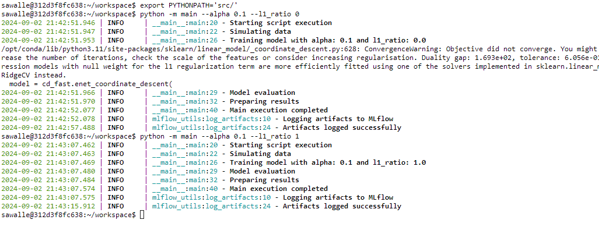
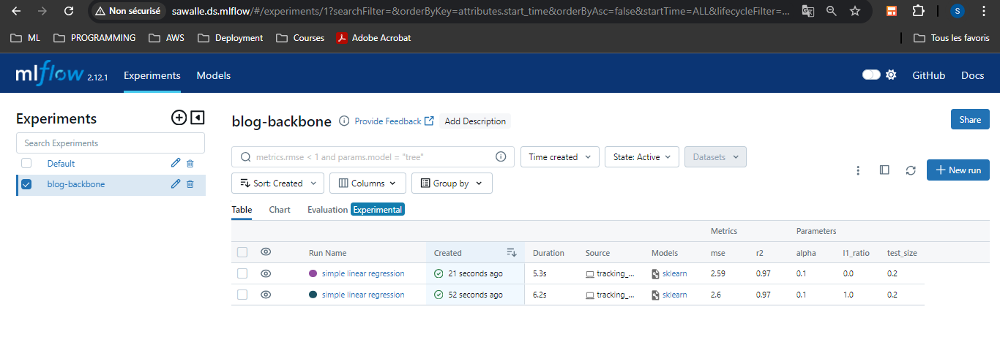
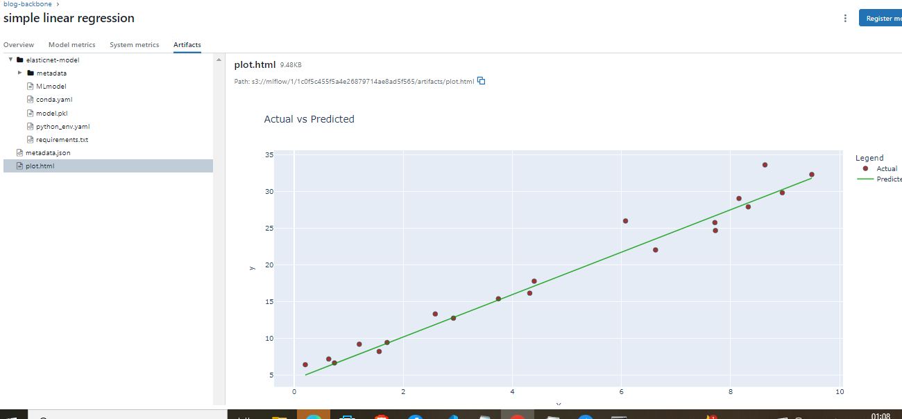

# MLflow & best practices

### Introduction

Dans un projet de machine learning, gérer les expérimentations et les modèles peut rapidement devenir un casse-tête. Imaginez : l'équipe s'agrandit, les données évoluent, les exigences fusent de toutes parts… et là, votre chef de projet débarque avec une demande spéciale : "Dis, tu te souviens de ce modèle super performant qu'on a testé en avril ? On aimerait le comparer avec nos résultats actuels."

<!-- more -->

À ce moment précis, à moins d'avoir une mémoire digne d'un éléphant, vous vous retrouvez à naviguer frénétiquement dans des fichiers Excel, des notes éparpillées ou même des post-its collés sur votre écran. Entre nous, c'est le genre de situation où l'on se dit : "Pourquoi je n’ai pas tout noté quelque part de façon plus propre ?!"

C’est justement là qu’**MLflow** entre en scène.

## Les Composantes de MLflow


MLflow est une plateforme open source qui gère tout le cycle de vie de vos modèles de machine learning. Voici ses principales fonctionnalités pour rendre votre vie (et celle de votre chef de projet) beaucoup plus simple :

1. **MLflow Tracking** : Un journal de bord détaillé qui consigne chaque expérimentation, avec les paramètres, métriques, artefacts, et même les versions de code. Plus besoin de deviner quels paramètres ont été utilisés pour ce modèle de mai dernier !

2. **MLflow Projects** : Pour structurer vos projets de manière reproductible, plutôt que d'avoir des scripts éparpillés un peu partout. MLflow Projects aide à organiser votre code et vos données, pour que tout soit toujours en ordre.

3. **MLflow Models** : Déployez facilement vos modèles, peu importe le framework utilisé (Scikit-learn, TensorFlow, PyTorch, etc.).

4. **Model Registry** : Gardez une trace de tous vos modèles, de leur version, et sachez lesquels sont en production ou en test. C’est comme une bibliothèque, mais pour vos modèles ML.

### Pourquoi Utiliser MLflow ?

À mesure que votre projet de machine learning évolue, vous faites face à plusieurs défis :

- **Semaine 1 : Les données changent constamment**  
  Vous commencez avec un jeu de données initial, mais rapidement, de nouvelles données arrivent, nécessitant des ajustements constants des pipelines et des tests d'intégration pour maintenir la cohérence.

- **Semaine 3 : Collaboration avec l'équipe**  
  Un nouveau data scientist rejoint l'équipe, apportant de nouvelles idées et méthodes. Vous devez suivre les contributions de chacun et coordonner les efforts pour éviter duplications et incohérences.

- **Semaine 5 : Multiplication des expérimentations**  
  Vous essayez divers modèles et configurations, et chaque expérimentation produit des résultats différents. Cela devient difficile de suivre quel modèle a été formé avec quels paramètres et quelles données.

- **Semaine 7 : Demandes croissantes des parties prenantes**  
  Les responsables de projet et les équipes métiers demandent des rapports sur les performances des modèles et souhaitent voir les meilleurs modèles déployés rapidement en production ou en test.

MLflow vous aide à répondre efficacement à ces défis en fournissant :

- **Une traçabilité complète des expérimentations** : Vous pouvez toujours savoir quels paramètres et données ont été utilisés pour chaque modèle.
- **Une collaboration facilitée** : Les contributions de chaque membre de l'équipe sont documentées et accessibles.
- **Une gestion simplifiée des déploiements** : MLflow permet de déployer facilement les modèles les plus performants pour les besoins des équipes métiers.

## Configuration de MLflow

En fonction de l'utilisation, la configuration de MLflow peut varier. Vous pouvez installer MLflow avec la commande suivante :

```bash
pip install mlflow
```

Pour des pratiques plus MLOps, MLflow est généralement hébergé sur un serveur spécifique, soit sur une machine virtuelle (via conteneur) ou sur le cloud. Vous pouvez consulter [ce projet GitHub](https://github.com/sawadogosalif/DS-backbone) pour un exemple de configuration de MLflow.


| **Configuration**                     | **Développement solo avec Localhost**                                                                                                                | **Développement solo avec Base de Données Locale**                                                                                                      | **Développement en Équipe avec Serveur MLflow**                                                                                                                   |
|---------------------------------------|---------------------------------------------------------------------------------------------------------------------------------------------------------|----------------------------------------------------------------------------------------------------------------------------------------------------------|-----------------------------------------------------------------------------------------------------------------------------------------------------------------|
| **Scénario**                          | Localhost (par défaut)                                                                                                                                  | Suivi local avec base de données                                                                                                                            | Suivi distant avec serveur MLflow                                                                                                                                |
| **Cas d'utilisation**                 | Développement solo                                                                                                                                      | Développement solo                                                                                                                                          | Développement en équipe                                                                                                                                           |
| **Description**                       | Par défaut, MLflow enregistre les métadonnées et artefacts de chaque run dans un répertoire local, `mlruns`. C'est la méthode la plus simple pour démarrer sans configuration supplémentaire. | Le client MLflow peut se connecter à une base de données compatible SQLAlchemy (par ex. SQLite, PostgreSQL, MySQL). Cela permet une meilleure gestion des données d'expérimentation sans avoir à configurer un serveur. | Le serveur de suivi MLflow peut être configuré avec un proxy HTTP pour les artefacts, permettant de gérer les requêtes d'artefacts via le serveur de suivi sans interagir directement avec les services de stockage (S3 par exemple) et une base de données pour le suivi. Idéal pour les développements en équipe avec stockage centralisé. |

## Organisation du Projet

Pour intégrer MLflow proprement et efficacement, il est recommandé d’isoler le code fonctionnel du code de suivi. Voici une structure de projet exemple :

```
project/
│
├── main.py                # Script principal d'exécution
└── src/
    ├── __init__.py        # Init du package src
    ├── modeling.py        # Code pour l'entraînement et l'évaluation des modèles
    ├── plot_utils.py      # Fonctions utilitaires pour les graphiques
    └── mlflow_utils.py    # Fonctions spécifiques à MLflow pour enregistrer les résultats
```

### Comment ça Fonctionne ?

- **`main.py`** : Le script principal qui s’occupe de la préparation des données, de l’entraînement du modèle et de l’appel aux fonctions utilitaires. À la fin du script, MLflow captera les résultats.

- **`src/modeling.py`** : Contient le code pour l’entraînement et l’évaluation des modèles. MLflow reste en coulisse pour ne pas encombrer votre code avec des appels au tracking.

- **`src/plot_utils.py`** : Gère la visualisation, que ce soit des courbes de performance ou des graphiques d’erreurs.

- **`src/mlflow_utils.py`** : Ce fichier contient uniquement du code MLflow pour enregistrer les paramètres, les métriques, les artefacts, et le modèle. Il suit simplement ce que vous lui donnez sans interférer avec le reste.

### Exemple de Code

#### `src/mlflow_utils.py`

Voici un exemple de fonction pour enregistrer les artefacts avec MLflow :

```python
from loguru import logger
import matplotlib.pyplot as plt
import mlflow

def log_artifacts(metrics, params, fig, model):
    """
    Enregistre les paramètres, métriques, graphiques, et modèle dans MLflow.

    Args:
        metrics (dict): Dictionnaire des métriques de performance du modèle.
        params (dict): Dictionnaire des paramètres du modèle.
        fig (plotly figure): Graphique des résultats.
        model (object): Le modèle entraîné (par exemple, un modèle scikit-learn).
    """
    try:
        logger.info("Logging parameters to MLflow")
        mlflow.log_params(params) 

        logger.info("Logging metrics to MLflow")
        mlflow.log_metrics(metrics) 

        logger.info("Logging figure to MLflow")
        fig_path = "results_plot.png"
        fig.savefig(fig_path)
        mlflow.log_artifact(fig_path, "figures")  

        logger.info("Logging model to MLflow")
        mlflow.sklearn.log_model(model, "model")  

        logger.info("All artifacts logged successfully")
    except Exception as e:
        logger.error(f"Failed to log artifacts: {e}")
```

#### `src/plot_utils.py`

Voici une fonction pour créer un graphique comparant les valeurs réelles et prédites :

```python
import plotly.graph_objects as go

def create_plot(X_test, y_test, y_pred):
    """Crée un graphique comparant les valeurs réelles aux valeurs prédites avec des points pour les vraies valeurs et une ligne pour les prédites."""
    fig = go.Figure()

    fig.add_trace(go.Scatter(
        x=X_test.squeeze(), 
        y=y_test, 
        mode='markers', 
        name='Actual', 
        marker=dict(size=8, color='rgba(152, 0, 0, .8)', line=dict(width=1, color='DarkSlateGrey'))
    ))

    fig.add_trace(go.Scatter(
        x=X_test.squeeze(), 
        y=y_pred, 
        mode='lines', 
        name='Predicted',
        line=dict(color='rgba(0, 152, 0, .8)', width=2)
    ))

    fig.update_layout(


        title='Actual vs Predicted Values',
        xaxis_title='Feature Value',
        yaxis_title='Target Value',
        template='plotly_white'
    )

    return fig
```


#### `src/modeling.py`

Voici un exemple de module modeling:
```python
import numpy as np
import pandas as pd
from sklearn.linear_model import ElasticNet
from sklearn.metrics import mean_squared_error, r2_score

def simulate_data(seed=42, size=100):
    """Simulates data for training."""
    np.random.seed(seed)
    X = np.random.rand(size, 1) * 10
    y = 3 * X.squeeze() + 4 + np.random.randn(size) * 2
    return pd.DataFrame(data={'X': X.squeeze(), 'y': y})

def train_model(X_train, y_train, alpha, l1_ratio):
    """Trains an ElasticNet model."""
    model = ElasticNet(alpha=alpha, l1_ratio=l1_ratio, random_state=42)
    model.fit(X_train, y_train)
    return model

def evaluate_model(model, X_test, y_test):
    """Evaluates the model on the test set."""
    y_pred = model.predict(X_test)
    mse = round(mean_squared_error(y_test, y_pred), 2)
    r2 = round(r2_score(y_test, y_pred), 2)
    return y_pred, {"mse": mse, "r2": r2}
```


### Script Principal main.py :

Le script principal utilise log_artifacts pour intégrer MLflow et suivre l'entraînement et l'évaluation du modèle.

```python
from loguru import logger 
import argparse
import mlflow
from sklearn.model_selection import train_test_split
from modeling import simulate_data, train_model, evaluate_model
from mlflow_utils import log_artifacts
from plot_utils import create_plot

# Constants
EXPERIMENT_NAME = 'blog-backbone'
RUN_NAME = "simple linear regression"
REMOTE_SERVER_URL = "http://mlflow_server:5000" 

def main(alpha, l1_ratio):
    """Fonction principale pour exécuter l'entraînement et l'évaluation du modèle."""
    logger.info("Starting script execution")
    
    logger.info("Simulating data")
    data = simulate_data()
    X_train, X_test, y_train, y_test = train_test_split(data[['X']], data['y'], test_size=0.2, random_state=42)
    
    logger.info("Training model with alpha: {} and l1_ratio: {}".format(alpha, l1_ratio))
    model = train_model(X_train, y_train, alpha, l1_ratio)
    
    logger.info("Model evaluation")
    y_pred, metrics = evaluate_model(model, X_test, y_test)
    
    logger.info("Preparing results")
    params = {
        "alpha": alpha,
        "l1_ratio": l1_ratio,
        "test_size": 0.2
    }
    fig = create_plot(X_test, y_test, y_pred)

    logger.info("Main execution completed")
    return metrics, params, fig, model

if __name__ == "__main__":
    parser = argparse.ArgumentParser(description="ElasticNet model training script")
    parser.add_argument("--alpha", type=float, required=True, help="Alpha parameter for ElasticNet")
    parser.add_argument("--l1_ratio", type=float, required=True, help="L1 ratio parameter for ElasticNet")
    args = parser.parse_args()
    mlflow.set_tracking_uri(REMOTE_SERVER_URL)
    mlflow.set_experiment(EXPERIMENT_NAME)    
    with mlflow.start_run(run_name=RUN_NAME):
        metrics, params, fig, model = main(args.alpha, args.l1_ratio)
        log_artifacts(metrics, params, fig, model)
```

### Étape d'Exécution

Pour exécuter le projet et observer les résultats de l'enregistrement des expérimentations avec MLflow, on pourrait utiliser la procédure ci-après:

1. **Configuration du PYTHONPATH :**  
   Avant d'exécuter le script principal, configurez le `PYTHONPATH` pour que Python reconnaisse correctement les modules de votre projet. Sans cette configuration, vous pourriez être amené à utiliser des chemins relatifs dans le code, ce qui peut compliquer les choses. Configurez `PYTHONPATH` avec la commande suivante dans un terminal :

   ```bash
   export PYTHONPATH="src/"
   ```

   **Pourquoi utiliser `PYTHONPATH` ?**  
   L’utilisation de `PYTHONPATH` permet de spécifier le répertoire racine de vos modules Python, évitant ainsi les chemins relatifs compliqués dans votre code. Cela simplifie l'importation des modules et rend le code plus propre et plus maintenable.

2. **Exécution du Script Principal :**  
   Utilisez `argparse` pour rendre votre script paramétrable depuis la ligne de commande. Voici comment lancer le script avec différents paramètres :


   ```bash
   python -m main --alpha 0.1 --l1_ratio 0  #L2  ridge regression
   python -m main --alpha 0.1 --l1_ratio 1  #L1  lasso regression
   ```

   - **`argparse`** : Rend le script interactif et paramétrable depuis la ligne de commande, facilitant les tests avec différents paramètres sans modifier le code source.


Bien que vous puissiez utiliser des notebooks, il est souvent recommandé de travailler avec des fichiers `.py` pour une meilleure organisation et gestion du projet, notamment pour des projets de prototypage ou d'industrialisation.

---

### Interface Utilisateur MLflow

Après avoir exécuté les commandes ci-dessus, vous pouvez vérifier que les expérimentations sont correctement enregistrées en accédant à l'interface utilisateur de MLflow. Vous y trouverez les paramètres, les métriques, les graphiques, et les modèles associés à chaque expérimentation. Pour accéder à cette interface, vous devez utiliser l'URL de votre serveur MLflow. Personnellement, j'utilise un reverse proxy pour accéder à mon service. En mode local, vous pouvez démarrer l'interface utilisateur avec la commande `mlflow ui`.



Comme le montre l'image ci-dessus, les deux expérimentations que j'ai lancées sont enregistrées. Chacune affiche les paramètres, les métriques et les temps d'exécution. Vous pouvez obtenir plus de détails en cliquant sur une expérimentation spécifique.



Dans la section des artefacts de la première expérimentation, vous pouvez récupérer votre graphique (n'est-ce pas génial ?), ainsi que les métadonnées où sont sauvegardés les coefficients. Vous trouverez également le modèle enregistré, que vous pouvez utiliser directement pour faire des prédictions.


### Conclusion
Alors, la prochaine fois que quelqu’un vous demande de retrouver des resulats datant de trois mois, vous pourrez vous permettre de sourire et dire : "Pas de problème, je vais chercher ça dans MLflow." Parce qu'avec MLflow, fini le stress des données égarées et des paramètres oubliés ; tout est à portée de clic, prêt à être revisité, analysé et, bien sûr, utilisé à bon escient. Quand on utilise du Mlflow c'est que aimerait faire du MLOps et c'est déjà un bon debut. Faire du code propre vous permettra d'integrer mlfow dans vos projets

### Références: 
+ https://mlflow.org/docs/latest/index.html

